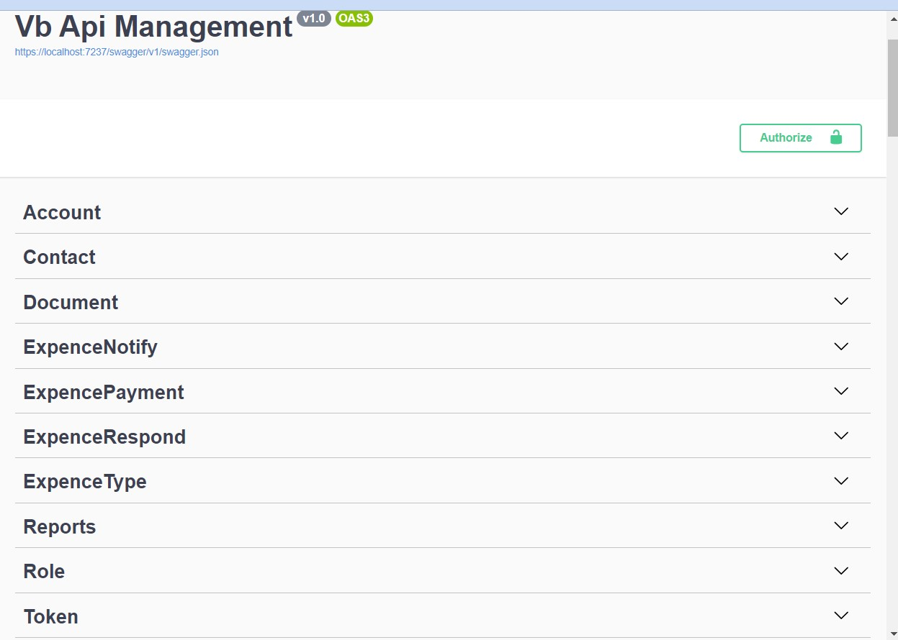
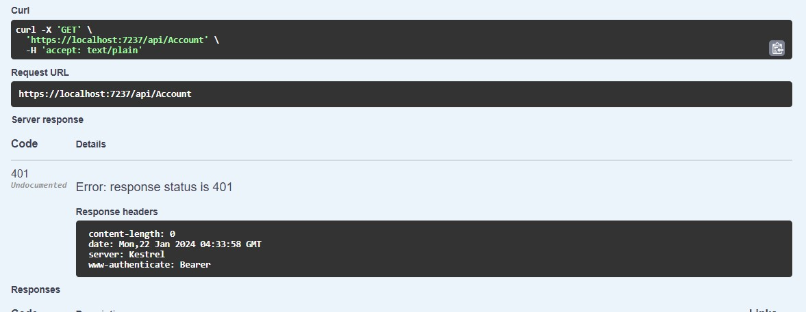
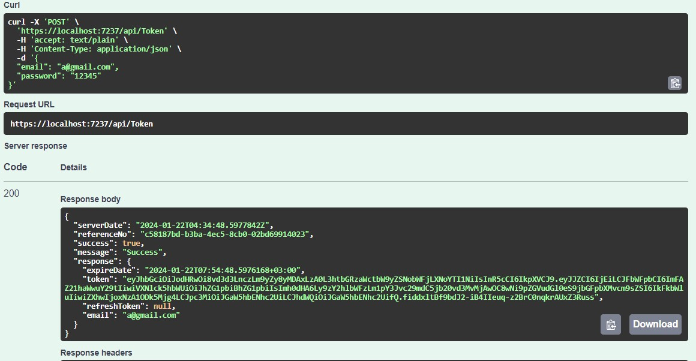
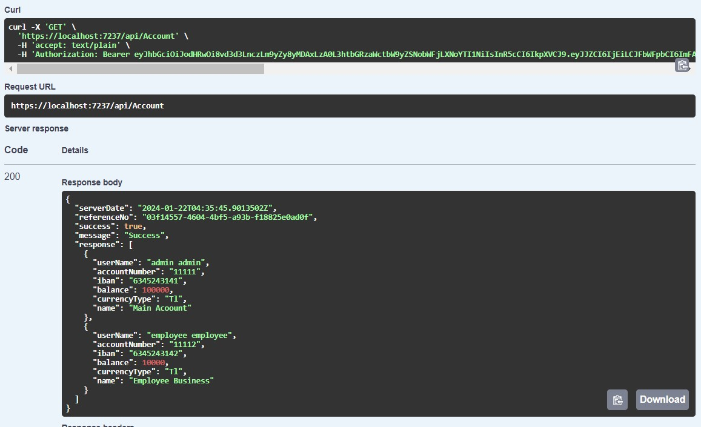
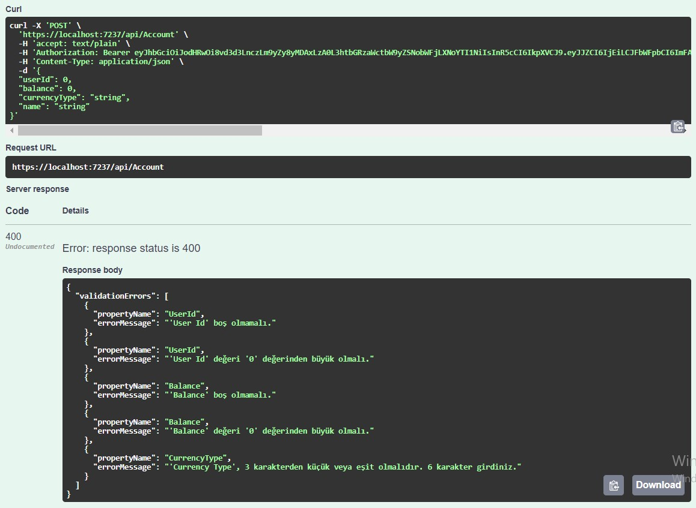
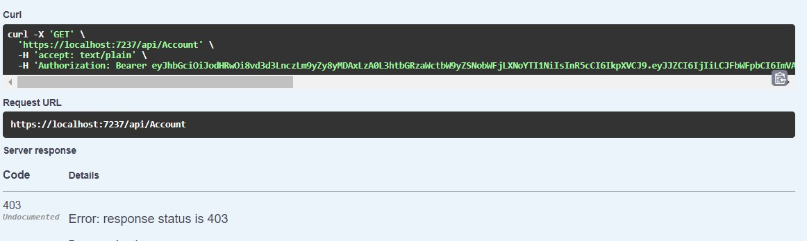
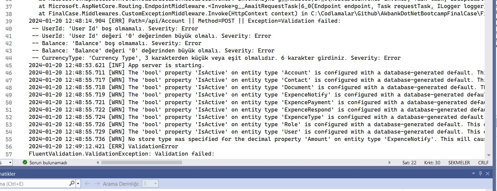
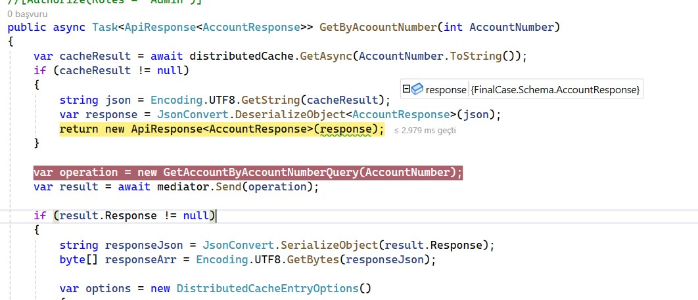
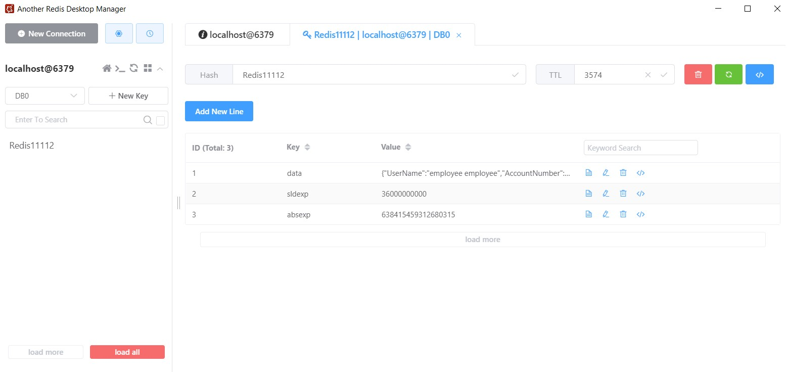

# Akbank .Net Bootcamp Final Case

Bu, Akbank ve PatikaDev tarafından düzenlenen Asp.Net eğitimi sürecinde verilen final görevi olan bir projenin son halidir. Bu süreçte bize yardımcı olan Akbank ve PatikaDev ekibine teşekkür ederim.

Projenin sonlarına doğru testleri yaparken Post metotlarının bir kısmında hata aldım. Bazı yerlerde Database üzerinde değişiklik yapmıştım, bu sürede büyük ihtimalle sorun oluşturdum. Çok fazla zamanım kalmadıgı için projeyi bu şekilde teslim diyorum. Diger metotlar çalışmakta. 

## Database komutları :
- Projede veri tabanı olarak Microsoft SQL Server kullanıldı. Migration eklemek için kullanılan komut:
    ```
        dotnet ef migrations add mig1 --project Vb.Data --startup-project Vb.Api
    ```
-  Eklenen Migration'ların uygulanması için kullanılan komut ise şu şekildedir:
    ```
           dotnet ef database update --project "./Vb.Data" --startup-project "./Vb.Api"
    ```
## Projenin Genel Yapısı: 
Final Projesi katmanlı bir yapı kullanılarak oluşturuldu. C QRS (Command ve Query) mimarisi kullanıldı.
### Shema Katmanı:
Request ve response için kullanılan sınıfları içerir.
### Data Katmanı:
 Veritabanı ve Entity Framework için kullanılan sınıfları içerir.
### Business  Katmanı:
Request doğrulamaları için kullanılan validasyon sınıfları, Command ve Query sınıfları ile AutoMapper burada bulunur.
### Base  Katmanı:
 Token ve response için kullanılan sınıfları içerir.
### FinalCase Web API Katmanı: 
 Controller'lar, servisler ve diğer sınıfları içerir.

## Configuration :
Configuration için kullanılan appsettings dosyasında:
-   Database MsSqlConnection string,
-   Hangfire için SqlConnection connection string,
-   Yetkilendirme için JwtConfig,
-   Distributed cache için Redis,
-   Serilog loglamaları için konfigure edilmiştir.

## Oluşturulan Conrollerlar va Metodlar
### Role: 
Kullanıcıların yetkilerini ayırmak için kullanılan sınıf.
### User: 
Kullanıcı bilgilerinin tutulması için kullanılan sınıf.
### ExpenceNotify: 
Kullanıcıların yapılan harcamaları bildirmesi için oluşturulan sınıf.
### ExpenceType: 
Harcama bildirimlerinin sınıflandırılması için kullanılan sınıf.
### ExpenceRespond: 
Harcama bildirimlerine admin tarafından verilen kararların tutulduğu sınıf.
### ExpencePayment: 
Admin tarafından verilen olumlu yanıt sonrasında hesaba para aktarılması için kullanılan sınıf.
### Document: 
Kullanıcıların belgeleri sisteme yüklemesi için kullanılan sınıf.
### Contact : 
 İletişim bilgilerinin tutulması için kullanılan sınıf.
### Account: 
Hesap bilgilerinin tutulması için kullanılan sınıf.


## Database : 
Projede Microsoft SQL Server ve Entity Framework kullanılarak veritabanı işlemleri gerçekleştirilmiştir.

## Yetkilendirme : 
Yetkilendirme için JwtToken kullanılmıştır. Kullanıcılar Admin ve Employee rolleri ile sınırlanmıştır. Admin bütün sayfalara erişim sağlayabilirken, Employee erişimi kısıtlanmıştır.

## Serilog : 
Serilog ve Middleware kullanılarak alınan hatalar loglanmaktadır.

## Redis Cache :
Redis ile Distributed Cache kullanılmıştır.


## Hangfire :
Hangfire ile arka planda çalışan fonksiyonlar eklenmiştir.

### DataGenerator Sınıfı:
- örnek verilerin kullanılması için oluşturduğum sınıf. User, Role vb. verilerinden oluşan Listleri InitializeEmployee ve InitializeStaff metotları ile oluşturmaktadır.

## Resimler
### Projenin Genel Görünümü

### Kullanıcı Girişi Olmadan Veri Alma Denemesi

### Token Oluşturma

### Yetkili Kullanıcı ile İstek Atma

### Hatalı POST Metodu Request Gönderme

### Yetkisiz Kullanıcı ile İstek Atma

### Serilog Hata Logları

### Redis ile Cache İşlemi

